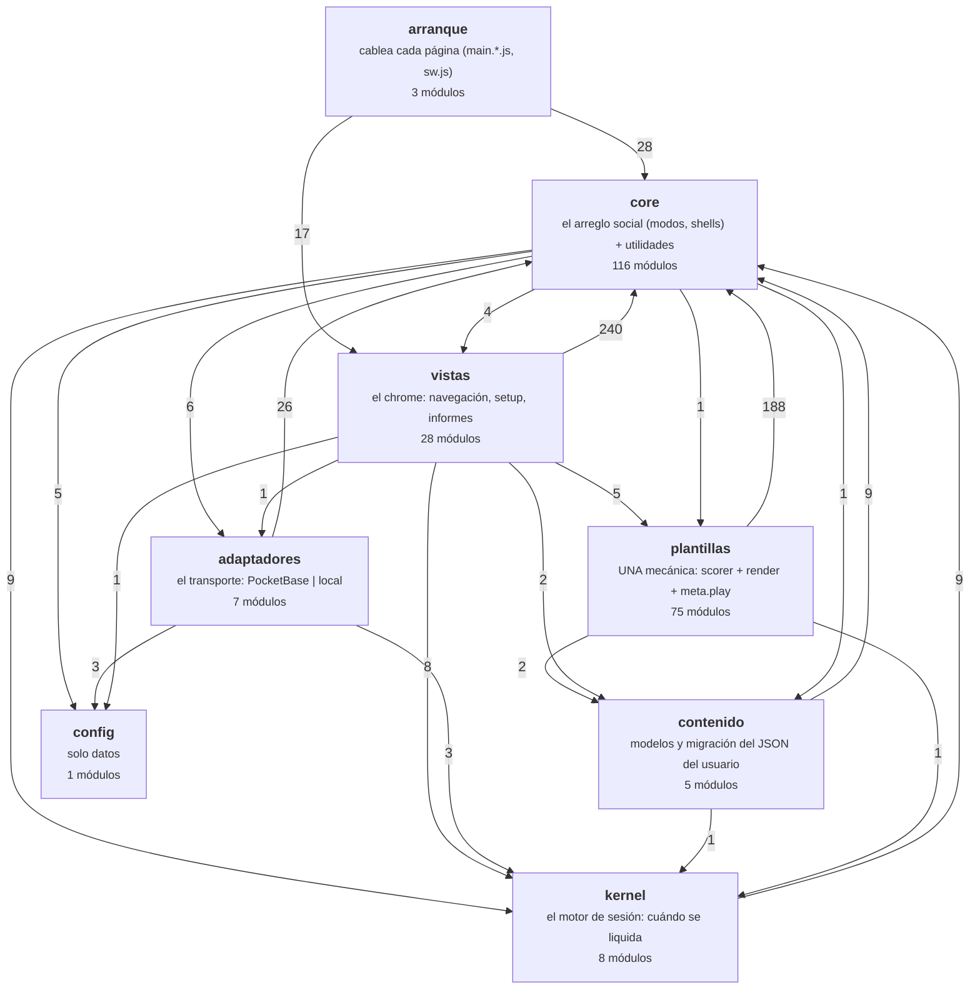

# Mapa de módulos — GENERADO, no editar a mano

> Lo produce `node tools/module-map.mjs` del grafo de imports REAL del repo.
> Si editas este archivo a mano, el siguiente `node tests/run.mjs` lo revierte
> (la suite `layers` comprueba que está al día). Para cambiar el dibujo, cambia
> el código — que es justo el punto.
>
> **243 módulos · 875 imports internos.**

## Las capas y cómo dependen unas de otras

Cada flecha va de quien importa a quien es importado, con cuántos imports hay.
La dirección legítima es siempre hacia abajo: **lo de arriba sabe de lo de
abajo, nunca al revés** (ley §0). Lo vigila `tests/layers.test.mjs`.

## Qué puede importar cada capa

| Capa | Puede importar | PROHIBIDO |
|---|---|---|
| **contenido** | core · kernel | plantillas · vistas · adaptadores |
| **plantillas** | core · contenido · kernel | vistas · adaptadores (una plantilla no sabe en qué modo corre) |
| **kernel** | core · contenido · config | vistas · adaptadores · plantillas concretas (el motor es puro) |
| **core** | kernel · contenido · config | vistas (salvo `import()` dinámico al montar un modo) · adaptadores concretos (solo la fachada `adapters/index.js`) |
| **adaptadores** | core · kernel · contenido · config | vistas · plantillas |
| **vistas** | todo lo de abajo | — |
| **config** | nada | es un fichero de datos |

## Dónde se acumula el tamaño (líneas)

| Capa | Módulos más grandes |
|---|---|
| **arranque** | `main.teacher.js` (156) · `main.embed.js` (68) · `main.student.js` (45) |
| **vistas** | `views/hostLive.js` (1031) · `views/adminView.js` (942) · `views/studentLive.js` (808) · `views/vsView.js` (475) · `views/playerView.js` (348) |
| **adaptadores** | `adapters/pocketbase/realtime.js` (1101) · `adapters/local/realtime.js` (321) · `adapters/pocketbase/remoteStore.js` (252) · `adapters/pocketbase/assignments.js` (167) · `adapters/index.js` (127) |
| **core** | `core/selftest.js` (331) · `core/skins.js` (327) · `core/textCorrectionRound.js` (325) · `core/auth.js` (307) · `core/vsAnimations.js` (269) |
| **kernel** | `kernel/session/engine.js` (502) · `kernel/session/memory.js` (102) · `kernel/contracts/template.js` (75) · `kernel/contracts/contentModel.js` (33) · `kernel/contracts/realtimePort.js` (31) |
| **plantillas** | `templates/crossword/player.js` (464) · `templates/wordsearch/player.js` (405) · `templates/match/player.js` (296) · `templates/quiz/editor.js` (283) · `templates/diagram/player.js` (233) |
| **contenido** | `kernel/content/qaAdapt.js` (104) · `kernel/content/convert.js` (95) · `kernel/content/switch.js` (82) · `kernel/content/models.js` (79) · `kernel/content/index.js` (5) |
| **config** | `pocketbase.config.js` (13) |

## Los módulos más importados (fan-in)

Un cambio aquí toca a mucha gente: son los que más test necesitan.

| Módulo | Lo importan |
|---|---|
| `core/html.js` | 80 |
| `core/events.js` | 45 |
| `core/registry.js` | 40 |
| `core/ids.js` | 22 |
| `core/storage.js` | 22 |
| `core/clock.js` | 21 |
| `core/toast.js` | 20 |
| `core/ls.js` | 17 |
| `core/gameEvents.js` | 17 |
| `kernel/session/engine.js` | 16 |
