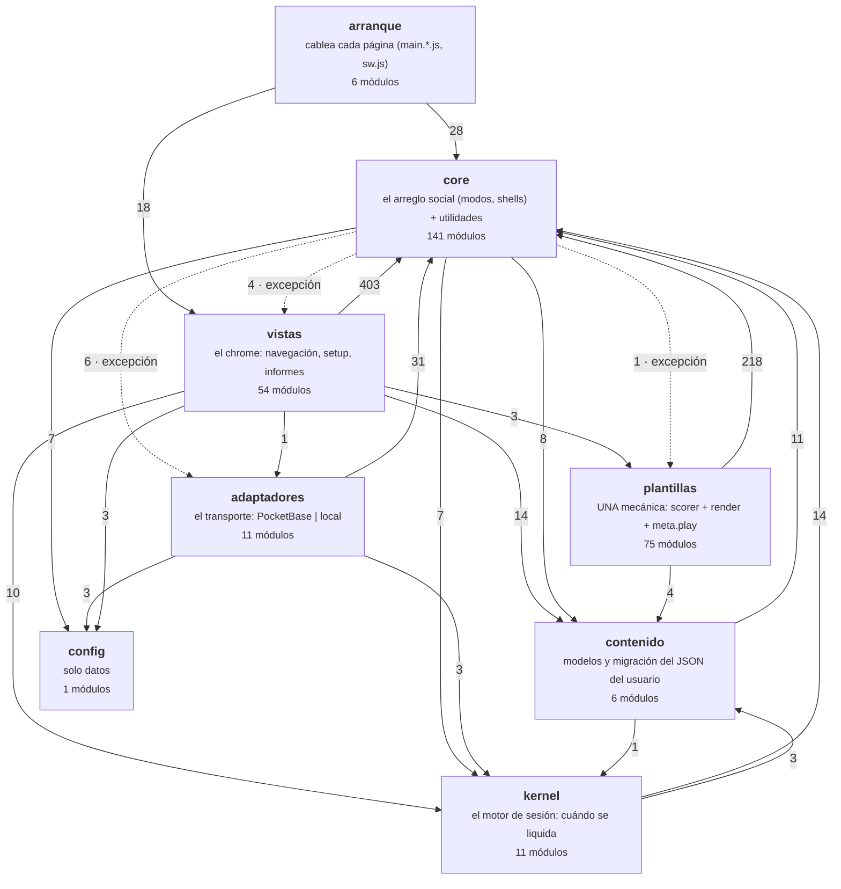

# Mapa de módulos — GENERADO, no editar a mano

> **Tipo**: generado · **Sube a**: [`docs/README.md`](README.md) · **Vigila**: `tests/layers.test.mjs` (regenerar: `node tools/module-map.mjs`)

> Lo produce `node tools/module-map.mjs` del grafo de imports REAL del repo.
> Si editas este archivo a mano, el siguiente `node tests/run.mjs` lo revierte
> (la suite `layers` comprueba que está al día). Para cambiar el dibujo, cambia
> el código — que es justo el punto.
>
> **305 módulos · 1249 imports internos.**

### Ir a otro documento

| Documento | Qué responde |
|---|---|
| [`norte.md`](norte.md) | para quién es la app, la escena real y cómo se decide (**manda sobre el resto**) |
| [`leyes.md`](leyes.md) | TODAS las leyes, cada una con el test que la vigila |
| [`modos-de-juego.md`](modos-de-juego.md) | contrato de los 5 modos y los 4 bucles en vivo |
| [`decisiones-pendientes.md`](decisiones-pendientes.md) | lo aplazado, con su condición para reabrirlo |
| [`estudio-bucles-live.md`](estudio-bucles-live.md) | por qué el vivo es como es (estudio medido) |
| [`testing.md`](testing.md) | las suites y las redes de seguridad del preflight |
| [`guia-testeo-companero.md`](guia-testeo-companero.md) | guía de pruebas paso a paso, para alguien no técnico |
| [`../CLAUDE.md`](../CLAUDE.md) | el mapa de entrada del repo: "quiero X → voy a Y" |

## Dónde está el esfuerzo, y dónde pasa el profesor

La pregunta que ninguna métrica neutra puede responder: **¿el código y los tests
están donde el profe pasa?** El uso de cada tramo sale de la escena real
(`docs/norte.md` §1); el reparto, del repo.

| Tramo del viaje | Cuánto se usa | Módulos · líneas | Suites · líneas | Test/código |
|---|---|---|---|---|
| **buscar/crear** | **siempre** — toda clase empieza aquí | 14 · 1900 | 7 · 1028 | 0.54 |
| **jugar en pizarra** | **lo habitual** — solo · VS · equipos, sin móviles | 12 · 2780 | 12 · 1415 | 0.51 |
| **jugar en vivo** | algunos colegios (alumnos con su propio móvil) | 38 · 4478 | 19 · 3093 | 0.69 |
| **informes/tareas** | después de clase | 10 · 1116 | 4 · 512 | 0.46 |
| **plantillas (mecánicas)** | siempre (es el contenido jugado) | 71 · 5948 | 13 · 1847 | 0.31 |
| **infra/común** | todo lo anterior | 160 · 19139 | 67 · 8475 | 0.44 |

> **OJO con el ratio de plantillas**: aquí solo se cuentan las suites de
> `tests/`. Las 13 mecánicas las juega de verdad `tools/matrix-smoke.mjs` (30/30
> con gesto real) y las teclea `tools/edit-audit.mjs`, que son ~600 líneas que
> esta tabla NO ve. El 0,18 es el suelo, no la cobertura real.
>
> Un ratio bajo en un tramo muy usado es deuda de PRIORIDAD, no de calidad: ese
> código funciona, pero si se rompe nadie se entera hasta que hay 33 críos
> delante. El mapeo módulo→tramo está declarado en
> `tests/helpers/journeyTracks.mjs` — explícito y revisable, no adivinado.

## Las capas y cómo dependen unas de otras

Cada flecha va de quien importa a quien es importado, con cuántos imports hay.
La dirección legítima es siempre hacia abajo: **lo de arriba sabe de lo de
abajo, nunca al revés** (ley §0). Lo vigila `tests/layers.test.mjs`.

## Qué puede importar cada capa

| Capa | Puede importar | PROHIBIDO |
|---|---|---|
| **contenido** | core · kernel | plantillas · vistas · adaptadores |
| **plantillas** | core · contenido · kernel | vistas · adaptadores (una plantilla no sabe en qué modo corre) |
| **kernel** | core · contenido · config | vistas · adaptadores · plantillas concretas (el motor es puro) |
| **core** | kernel · contenido · config | vistas (salvo `import()` dinámico al montar un modo) · adaptadores concretos (solo la fachada `adapters/index.js`) |
| **adaptadores** | core · kernel · contenido · config | vistas · plantillas |
| **vistas** | todo lo de abajo | — |
| **config** | nada | es un fichero de datos |

## Dónde se acumula el tamaño (líneas)

| Capa | Módulos más grandes |
|---|---|
| **arranque** | `pb_hooks/aulareto-lib.js` (364) · `pb_hooks/aulareto.pb.js` (354) · `qa/hoja.js` (330) · `main.teacher.js` (168) · `main.embed.js` (68) |
| **vistas** | `views/playerView.js` (538) · `views/vsView.js` (515) · `views/admin/collections.js` (453) · `views/hostLive.js` (341) · `views/live/hostRondas.js` (297) |
| **adaptadores** | `adapters/pocketbase/realtimeRooms.js` (483) · `adapters/pocketbase/realtimeAnswers.js` (388) · `adapters/pocketbase/realtime.js` (361) · `adapters/local/realtime.js` (324) · `adapters/pocketbase/remoteStore.js` (255) |
| **core** | `core/textCorrectionRound.js` (763) · `core/normsCheck.js` (474) · `core/skins.js` (421) · `core/aiContent.js` (385) · `core/auth.js` (368) |
| **kernel** | `kernel/session/teamsMachine.js` (182) · `kernel/session/liveMachine.js` (166) · `kernel/session/vsMachine.js` (155) · `kernel/session/memory.js` (102) · `kernel/contracts/template.js` (75) |
| **plantillas** | `templates/crossword/player.js` (496) · `templates/wordsearch/player.js` (382) · `templates/match/player.js` (304) · `templates/diagram/player.js` (266) · `templates/quiz/editor.js` (222) |
| **contenido** | `kernel/content/qaAdapt.js` (141) · `kernel/content/switch.js` (117) · `kernel/content/convert.js` (95) · `kernel/content/models.js` (83) · `kernel/content/sessionItems.js` (25) |
| **config** | `pocketbase.config.js` (13) |

## Los módulos más importados (fan-in)

Un cambio aquí toca a mucha gente: son los que más test necesitan.

| Módulo | Lo importan |
|---|---|
| `core/html.js` | 110 |
| `core/events.js` | 62 |
| `core/registry.js` | 55 |
| `core/toast.js` | 42 |
| `core/ids.js` | 27 |
| `core/clock.js` | 26 |
| `core/storage.js` | 24 |
| `core/gameEvents.js` | 24 |
| `kernel/content/sessionItems.js` | 23 |
| `core/auth.js` | 21 |

## Los módulos más grandes (candidatos a partir)

El tamaño no es un defecto por sí solo, pero es donde han caído las regresiones:
`views/hostLive.js` concentra lobby + los cuatro bucles + podio + tabla + CSV.

| Módulo | Líneas | Lo importan |
|---|---|---|
| `core/textCorrectionRound.js` | 763 | 5 |
| `views/playerView.js` | 538 | 1 |
| `views/vsView.js` | 515 | 2 |
| `templates/crossword/player.js` | 496 | 1 |
| `adapters/pocketbase/realtimeRooms.js` | 483 | 1 |
| `core/normsCheck.js` | 474 | 1 |
| `views/admin/collections.js` | 453 | 1 |
| `core/skins.js` | 421 | 12 |

## El mapa de DATOS: quién escribe cada colección

Ley §21 (una colección, un dueño) y §22 (quién puede escribir, según las reglas
REALES de `core/pbRules.js`). El panel `views/adminView.js` no se lista: es el
dueño del ESQUEMA y por eso las nombra todas.

| Colección | Módulo dueño | Quién puede CREAR |
|---|---|---|
| `activities` | `adapters/pocketbase/remoteStore.js` | con sesión, y solo como dueño |
| `results` | `adapters/pocketbase/remoteStore.js` | cualquiera, sin cuenta |
| `live_sessions` | `adapters/pocketbase/realtime.js` · `adapters/pocketbase/realtimeRooms.js` · `core/stressTest.js` · `core/raceE2e.js` | solo con sesión de profe |
| `live_answers` | `adapters/pocketbase/realtime.js` · `core/stressTest.js` · `core/raceE2e.js` | el alumno, **atado a su dispositivo** (§22-4) |
| `live_players` | `adapters/pocketbase/realtime.js` · `core/stressTest.js` · `core/raceE2e.js` | cualquiera, sin cuenta |
| `live_keys` | `adapters/pocketbase/realtime.js` · `adapters/pocketbase/realtimeRooms.js` | solo con sesión de profe |
| `live_claims` | `adapters/pocketbase/realtime.js` · `core/stressTest.js` · `core/raceE2e.js` | cualquiera, sin cuenta |
| `assignments` | `adapters/pocketbase/assignments.js` · `core/stressTest.js` · `adapters/index.js` | solo con sesión de profe |
| `assignment_attempts` | `adapters/pocketbase/assignments.js` · `core/stressTest.js` | regla propia (ver `core/pbRules.js`) |
| `reports` | `core/reports.js` | solo con sesión de profe |
| `activity_likes` | `core/likes.js` | con sesión, o el alumno bajo condiciones |
| `profiles` | `core/profile.js` | con sesión, y solo como dueño |
| `users` | `core/auth.js` · `core/teachers.js` | **nadie** (cerrado por API) |
| `ia_config` | `core/iaKeys.js` | **nadie** (cerrado por API) |
| `_superusers` | — | **nadie** (cerrado por API) |

> Un módulo que necesite datos no hace fetch a la colección: **le pide un método
> al dueño**. Lo vigila la regla `pb-dueno` de `tests/norms.test.mjs`.
