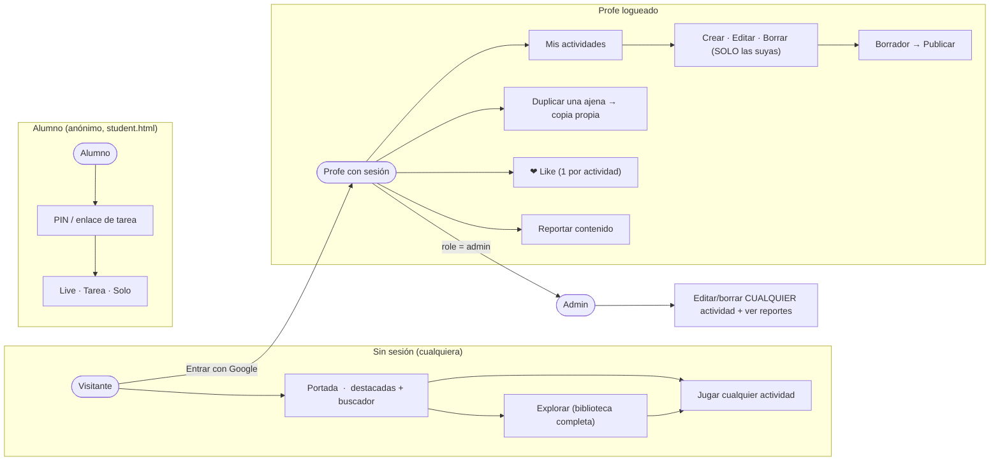
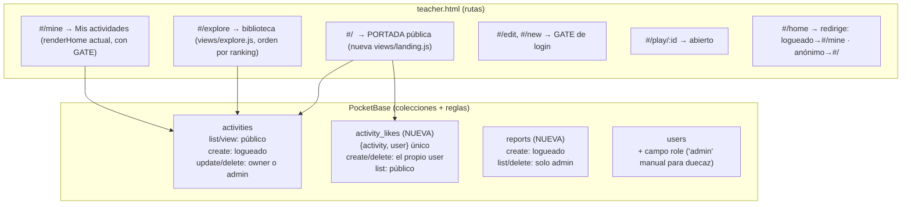
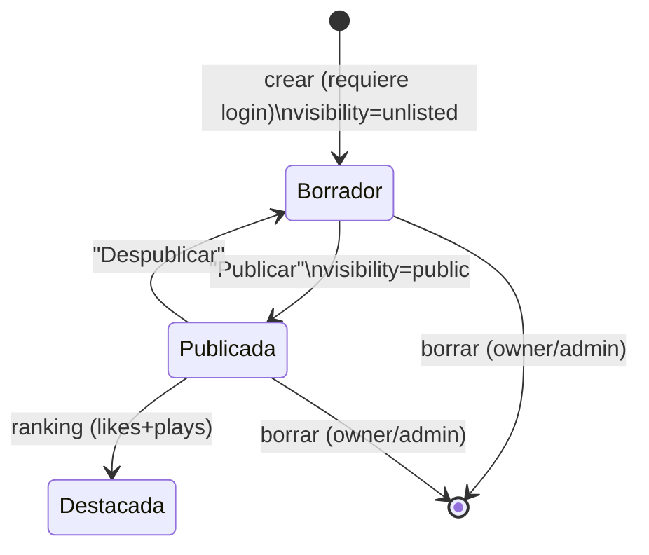

# HANDOFF — Biblioteca pública tipo Wordwall (portada · cuentas de profe · admin)

> **Estado: PLAN definitivo (Fable, 2026-07-21) → para ejecutar por Opus 4.8.**
> Sustituye/absorbe la discusión de chat. Prerequisito ya en código: login con Google
> (Fase A, v1.51.215, `docs/handoff-google-classroom.md`) y firma de escrituras +
> campo `owner` (v1.51.214, `docs/handoff-seguridad-pb.md`).

## Decisiones del usuario (cerradas)
- Modelo **tipo Wordwall**: cualquiera **ve y juega** todas las actividades. Nada es privado.
- **Solo profes con sesión (Google)** crean actividades; cada uno **edita/borra SOLO las suyas**.
- Se acaba la creación anónima.
- La **portada** es pública: pocas actividades, las **mejor puntuadas** + buscador.
  Al iniciar sesión aparece el botón/sección **"Mis actividades"**.
- **Rol admin** para el usuario (es barato): puede moderar/editar/borrar cualquier actividad.
- Los **alumnos siguen 100% anónimos** (PIN/enlace). No se registran nunca, no cuentan
  para el límite OAuth de Google.

## Decisiones de diseño (Fable — aplicar salvo que el usuario diga otra cosa)
1. **Ranking de destacadas**: ❤ likes de profes logueados (1 por profe y actividad),
   desempate por nº de partidas (proxy: filas de `results` por actividad) y frescura.
   Likes anónimos NO (spam trivial).
2. **Borrador → Publicar** reutilizando el campo `visibility` que YA existe:
   - `'unlisted'` = **borrador**: jugable por enlace/PIN, NO aparece en Explorar/portada.
   - `'public'` = **publicada**: entra a la biblioteca y puede ser destacada.
   - `'private'` se RETIRA del selector del editor (nada es privado). Al crear → borrador.
3. **Moderación mínima**: botón "Reportar" (solo logueados) + el admin revisa y puede
   editar/borrar cualquier cosa. Sin colas ni flujos complejos.
4. **Claim al primer login**: las actividades que ya viven en el navegador se marcan
   como del profe que entra (migración sin pérdida, ver S1).
5. **Almacén local por usuario**: `Mis actividades` se guarda por `userId` (varios
   profes pueden compartir navegador sin mezclarse).

## Panorama (diagramas)

### Quién puede hacer qué

### Rutas y datos

### Estados de una actividad

---

## FASES DE EJECUCIÓN (Opus: en este orden, un commit-bloque por fase, tests en cada una)

### FASE S1 ✅ HECHO (v1.51.217) — Identidad efectiva: gate + claim + almacén por usuario (SOFT, sin endurecer reglas)
Nada se rompe si el usuario aún no configuró Google/PB; el gate solo aparece donde aplica.
1. **`core/authGate.js`**: `requireTeacher(rootSel, renderFn)` — si no hay sesión pinta
   una pantalla amable ("Entra con Google para crear y gestionar tus actividades",
   botón del authWidget); si hay, delega en la vista. Gatear: `#/new`, `#/edit*`,
   `#/mine`, `#/edit-list`, `#/tasks`. NO gatear: portada, explore, play, live, sorteo.
2. **Almacén por usuario** (`core/storage.js`): `currentKey()` pasa a
   `ww.activities.<userId>` (guest = clave legacy `ww.activities`). `setStorageUser`
   ya existe y los mains ya lo llaman — implementar de verdad la separación.
   ⚠️ Cuidado: tombstones y `SYNCED_KEY` también por usuario o con id incluido.
3. **Claim al primer login** (una vez por usuario, flag en localStorage):
   coger el mapa legacy (guest), poner `owner = userId` a cada actividad, guardarlas
   en la clave del usuario y re-subirlas (save → PATCH con owner). Como TODAS las
   actividades del usuario están en su navegador, esto backfillea PB sin comandos
   manuales. Dejar el mapa guest vacío tras migrar (o marcado como migrado).
4. **`sync()` filtra por dueño**: `listActivities` debe traer SOLO las del usuario
   (`filter=owner='<id>'` con pbFilter) — si no, al hacerse pública la biblioteca el
   sync llenaría "Mis actividades" con las de todo el mundo. Guest: no sync remoto.
5. Tests: gate (con/sin sesión, mock), storage por usuario (dos users no se mezclan),
   claim idempotente (segunda vez no duplica), filtro de sync (URL con owner).

### FASE S2 ✅ HECHO (v1.51.218) — Portada pública + Explorar + likes + publicar
> DESVIACIÓN del plan (seguridad de transición): `#/mine` NO se gatea — VER las
> propias es libre (un profe que aún no configuró Google sigue viendo sus borradores
> locales). Solo CREAR/EDITAR (#/new, #/edit*) exigen sesión. El gate de #/mine se
> valorará en S3 cuando el login ya esté operativo.
1. **`views/landing.js`** (nueva, ruta `#/`): hero corto + grid de 6-8 destacadas
   (reusar `homePreviewHtml` + `previewBgStyle`) + buscador que lleva a Explorar +
   CTA "Entrar con Google" si no hay sesión / "Mis actividades" si la hay.
   Estilo: paleta crema/navy de home.css (chrome → EXCLUDED del ratchet si es CSS nuevo).
2. **Ranking** (`core/ranking.js`, PURO y testeable): `computeFeatured(activities, likes, plays)`
   → orden por likes desc, luego plays desc, luego updatedAt desc. v1: agregación
   client-side (fetch likes + counts de results); anotar upgrade a contador
   denormalizado vía pb_hook en la Pi cuando crezca.
3. **Likes**: colección `activity_likes` en el setup del admin (`{activity: text, user: text}`,
   índice único (activity,user), createRule/deleteRule `@request.auth.id != '' && user = @request.auth.id`,
   listRule ''). Botón ❤ en tarjetas de portada/explore (logueados; anónimo → tooltip "entra para votar").
4. **Publicar**: en el editor y en la tarjeta de Mis actividades, toggle
   Borrador/Publicada (visibility unlisted/public). Al crear → unlisted. Retirar
   'private' del selector. Explore/portada solo muestran `visibility='public'`.
5. **Rutas**: `#/` → landing; `#/home` → redirect según sesión; `#/mine` → el
   renderHome actual (gateado). Revisar TODOS los enlaces `#/home` del código.
6. Tests: ranking puro (orden y desempates), landing pinta N destacadas (headless),
   redirect de `#/home` según sesión, explore solo public.

### FASE S3 — Reglas DURAS + admin + reportar (requiere al usuario en su Pi)
1. **`users.role`**: campo text en la colección users (setup admin lo añade con merge
   seguro). El usuario se pone `role='admin'` a sí mismo desde el panel PB (manual, 1 vez).
2. **Reglas finales de `activities`** en el setup del admin:
   - `listRule/viewRule`: `''` (público)
   - `createRule`: `@request.auth.id != ''`
   - `updateRule/deleteRule`: `owner = @request.auth.id || @request.auth.role = 'admin'`
   - (fuera la cláusula transitoria `owner = ''` — para entonces el claim de S1 ya
     backfilleó; documentar que actividades de un navegador nunca-logueado quedarían
     huérfanas y solo el admin podría adoptarlas).
3. **`reports`**: colección `{activity: text, by: text, reason: text}`;
   createRule `@request.auth.id != ''`; list/view/delete solo admin. Botón "Reportar"
   en actividades públicas (logueados). Vista simple de reportes en `#/admin` (solo admin).
4. **UI admin**: si `role='admin'`, en Explorar aparecen Editar/Borrar sobre cualquier
   actividad (la regla PB lo respalda).
5. **Checklist de aplicación para el usuario** (como en handoff-seguridad-pb.md):
   re-correr setup de colecciones, ponerse role admin, y PROBAR en dispositivo:
   crear sin login → bloqueado; editar ajena sin ser admin → 403; alumno juega por
   PIN → sigue OK.
6. Tests: reglas construidas en adminView (shape del payload), gate duro, y los
   checkers de normas en verde.

### FASE S4 — Classroom (ya planificada aparte)
Sigue `docs/handoff-google-classroom.md` Fase B. No mezclar con S1-S3.

## Reglas de ejecución (las de siempre)
- VERSION bump + `node tests/run.mjs` verde en cada commit; push a rama de trabajo +
  `main` (sirve aulareto.com) + `ACTIVIDAD2`. TODO AL MAIN.
- Si es norma, es test. Verificación headless de portada/gate (receta docs/testing.md).
- NO tocar los flujos de alumno (student.html): los alumnos nunca leen `activities`
  (Live/Tareas llevan snapshot propio) — mantener esa invariante.
- Ir marcando ✅ aquí con la versión de cada fase.

## Riesgos / cuidados
- **S1.2 (clave por usuario)** es el cambio más delicado: migrar guest→user sin perder
  nada y sin romper tombstones/synced-cache. Test antes de tocar; claim reversible.
- El `perPage=200` de listActivities quedará corto con biblioteca grande → paginar en
  Explorar (no bloqueante para el piloto).
- La agregación client-side de likes/plays es O(biblioteca); aceptable en piloto,
  upgrade a contadores con pb_hooks (el usuario controla la Pi) cuando duela.
- El editor usa `visibility` hoy con 3 valores; revisar callers al retirar 'private'
  (grep `visibility`).
