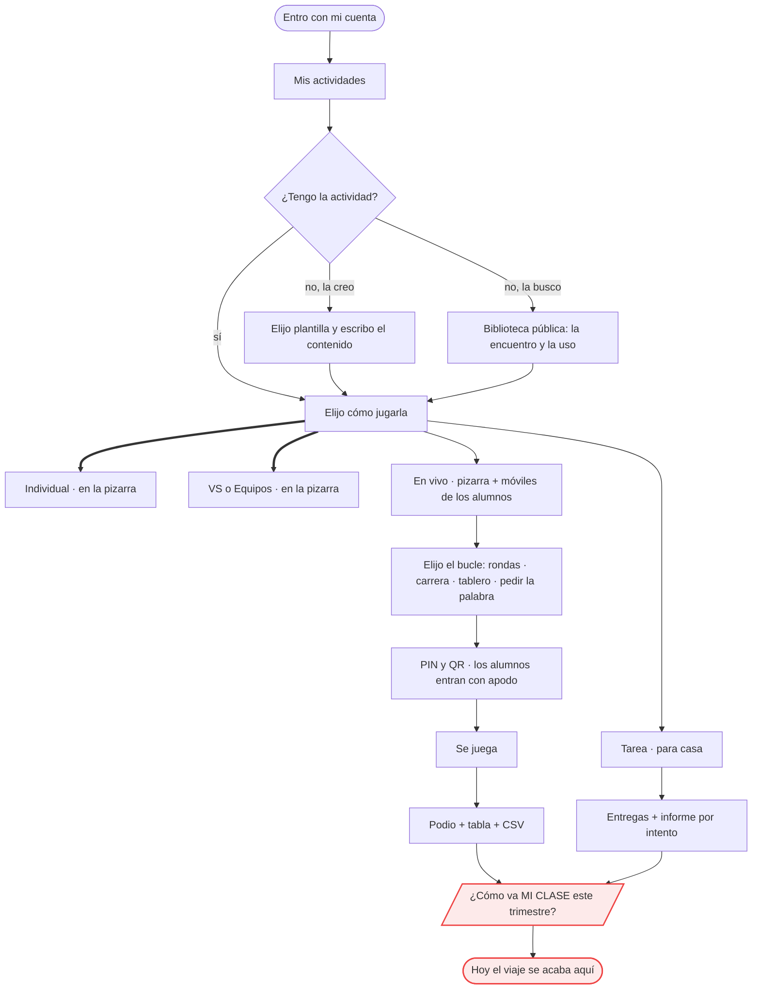

# EL NORTE — para quién es esto, y cómo se decide

> **Rango**: este documento manda sobre los demás. [`leyes.md`](leyes.md) dice cómo se
> construye; **este dice qué construimos y para quién**. Si una ley y el norte
> chocan, gana el norte y la ley se replantea.
>
> **Estado** (v1.51.377). CONFIRMADO por el usuario: §1 escena · §2b presupuesto
> de tiempo · §3 restricciones · §4 "lo que no somos" · **§4c/§4d dos familias
> (ejercicios y juegos)** · **§7c la entrada y el menú** · §5 referentes en lo
> esencial (⏳ pendiente de un ESTUDIO: documentarse y probar a fondo los
> referentes para saber qué partes encajan con nuestra escena).
> **APLAZADO por decisión** (§4b): §6d señales · alumnos identificados (D1) ·
> IA generando actividades · otros idiomas (solo español por ahora) ·
> accesibilidad avanzada. Ninguno es un olvido: cada uno con su condición.
> §3 R7 (privacidad de menores), §3b actores, §3c degradación y §6e vocabulario
> describen lo que YA hacen el código y las reglas del servidor — salvo la
> columna "se dice" del vocabulario, que es la decisión que falta aplicar.

<!-- GENERADO:nav -->
### Índice de este documento

- [1. La escena](#1-la-escena)
- [1b. El ciclo de una clase: antes · durante · después](#1b-el-ciclo-de-una-clase-antes--durante--después)
- [2. La promesa (una frase)](#2-la-promesa-una-frase)
- [2b. El presupuesto de tiempo ✅ CONFIRMADO](#2b-el-presupuesto-de-tiempo--confirmado)
  - [ANTES · el profe llega con la clase preparada](#antes--el-profe-llega-con-la-clase-preparada)
  - [DURANTE · el montaje, con 33 críos mirando](#durante--el-montaje-con-33-críos-mirando)
  - [DURANTE · el ritmo de conducción ⭐](#durante--el-ritmo-de-conducción-)
  - [DURANTE · en vivo (el caso raro)](#durante--en-vivo-el-caso-raro)
  - [DESPUÉS · revisar, en segundos](#después--revisar-en-segundos)
- [3. Las restricciones duras](#3-las-restricciones-duras)
- [3b. Los actores, y qué puede cada uno](#3b-los-actores-y-qué-puede-cada-uno)
- [3c. Qué pasa cuando algo falla (degradación declarada)](#3c-qué-pasa-cuando-algo-falla-degradación-declarada)
- [4. Lo que NO somos ✅ CONFIRMADO](#4-lo-que-no-somos--confirmado)
- [4b. Lo que NO haremos TODAVÍA (aplazado con condición)](#4b-lo-que-no-haremos-todavía-aplazado-con-condición)
- [4c. LAS DOS FAMILIAS: ejercicios y juegos ✅ CONFIRMADO](#4c-las-dos-familias-ejercicios-y-juegos--confirmado)
  - [El eje NO es pedagógico/lúdico. Es quién pone el contenido](#el-eje-no-es-pedagógicolúdico-es-quién-pone-el-contenido)
  - [La regla de decisión (tres preguntas, sin discusión)](#la-regla-de-decisión-tres-preguntas-sin-discusión)
  - [El catálogo de juegos está ACOTADO en OCHO](#el-catálogo-de-juegos-está-acotado-en-ocho)
  - [El eje de los ejercicios es la MECÁNICA](#el-eje-de-los-ejercicios-es-la-mecánica)
  - [El momento de clase de cada familia — esto es lo que manda](#el-momento-de-clase-de-cada-familia--esto-es-lo-que-manda)
  - [Lo que se DERIVA de la distinción (para no discutirlo pieza a pieza)](#lo-que-se-deriva-de-la-distinción-para-no-discutirlo-pieza-a-pieza)
- [4d. Y lo que NO haremos con los juegos](#4d-y-lo-que-no-haremos-con-los-juegos)
- [5. Los referentes: qué tomamos y qué no ✅ CONFIRMADO · ⏳ falta detallar](#5-los-referentes-qué-tomamos-y-qué-no--confirmado---falta-detallar)
- [6. El criterio de decisión](#6-el-criterio-de-decisión)
- [6b. DE DÓNDE SE DESPRENDE CADA LEY — la cadena de derivación](#6b-de-dónde-se-desprende-cada-ley--la-cadena-de-derivación)
- [6c. CÓMO SE DECIDE LA ARQUITECTURA](#6c-cómo-se-decide-la-arquitectura)
- [6d. Señales de que vamos bien — APLAZADO](#6d-señales-de-que-vamos-bien--aplazado)
- [6e. UNA COSA, UN NOMBRE (vocabulario)](#6e-una-cosa-un-nombre-vocabulario)
- [7. El viaje del profesor — dónde estamos](#7-el-viaje-del-profesor--dónde-estamos)
- [7b. INVENTARIO: lo que YA tenemos, y dónde encaja](#7b-inventario-lo-que-ya-tenemos-y-dónde-encaja)
  - [Las 13 plantillas — 12 ejercicios y 1 juego](#las-13-plantillas--12-ejercicios-y-1-juego)
  - [Los cinco modos](#los-cinco-modos)
  - [Lo que sostiene todo eso](#lo-que-sostiene-todo-eso)
- [7c. LA ENTRADA Y EL MENÚ ✅ CONFIRMADO](#7c-la-entrada-y-el-menú--confirmado)
  - [Lo que hacen los referentes (mirado, no supuesto)](#lo-que-hacen-los-referentes-mirado-no-supuesto)
  - [La entrada](#la-entrada)
  - [El menú: CUATRO entradas, y ninguna se llama "Alumno"](#el-menú-cuatro-entradas-y-ninguna-se-llama-alumno)
  - [Y cuándo tocaría cambiarlo](#y-cuándo-tocaría-cambiarlo)
- [8. LA COLA, DERIVADA DEL NORTE (no de la inercia)](#8-la-cola-derivada-del-norte-no-de-la-inercia)
- [9. Cómo se relaciona con el resto de la documentación](#9-cómo-se-relaciona-con-el-resto-de-la-documentación)

### Ir a otro documento

| Documento | Qué responde |
|---|---|
| [`leyes.md`](leyes.md) | las 8 leyes, cada una con el test que la vigila |
| [`arquitectura-modulos.md`](arquitectura-modulos.md) | la radiografía: capas, imports, esfuerzo por tramo y mapa de datos (GENERADO) |
| [`modos-de-juego.md`](modos-de-juego.md) | contrato de los 5 modos y los 4 bucles en vivo |
| [`decisiones-pendientes.md`](decisiones-pendientes.md) | lo aplazado, con su condición para reabrirlo |
| [`estudio-bucles-live.md`](estudio-bucles-live.md) | por qué el vivo es como es (estudio medido) |
| [`testing.md`](testing.md) | las suites y las cuatro redes de seguridad |
| [`guia-testeo-companero.md`](guia-testeo-companero.md) | guía de pruebas paso a paso, para alguien no técnico |
| [`../CLAUDE.md`](../CLAUDE.md) | el mapa de entrada del repo: "quiero X → voy a Y" |
<!-- /GENERADO:nav -->

---

## 1. La escena

Un profesor, en su aula, con una **pizarra interactiva** y **unos 33 alumnos**
delante. **Prepara una actividad o BUSCA una ya hecha**, y la usa **unos
minutos**: como introducción, como la actividad del día o para explicar algo.

> **La actividad no es la clase: la enriquece.** Son minutos dentro de una
> sesión que el profe ya tenía preparada. Eso manda sobre todo lo demás: si algo
> exige montar la clase alrededor de la app, está mal planteado.

**Quien toca la pizarra es, la mayoría de las veces, UN ALUMNO.** El profesor la
usa algunas veces —para poner el ejemplo y **lanzar la pregunta a toda la
clase**, que responde a mano alzada—, pero lo normal es que salga un alumno,
resuelva delante de todos y vuelva a su sitio.

**Para qué existe la actividad**: para **despertar el interés y hacer
PARTICIPAR** al alumno. Es un refuerzo dentro de la clase, y la clase es lo
importante.

**Cuánta actividad cabe**: de **1 a 5 actividades** en una clase de una o dos
horas pedagógicas. **No salen los 30 alumnos**: es imposible, se comería la hora
y no quedaría clase.

| | Quién toca la pantalla | Cómo participa el resto | Cuánto se usa |
|---|---|---|---|
| **Individual** | **un alumno** que sale; a veces el profe (ejemplo) | mirando, y a mano alzada | **lo habitual** |
| **VS (duelo)** | **dos alumnos** que salen | la clase anima y responde | **lo habitual** |
| **Equipos** | sale alguien del equipo cuando le toca | por equipos, desde su sitio | a veces |
| **En vivo** | cada alumno en su móvil | todos a la vez, sentados | **raro** — solo algunos colegios |
| **Tarea** | el alumno, fuera de clase | — | ocasional |

> **Dos consecuencias de diseño, y las dos pesan:**
>
> **(a) El que toca puede ser un niño de 8-12 años, sin que nadie le explique.**
> La pantalla de juego tiene que entenderse sola: instrucciones a la vista,
> objetivos grandes, y ninguna forma de quedarse atascado.
>
> **(b) Ese niño está tocando la sesión del PROFE.** La pizarra tiene la cuenta
> del profesor abierta: mientras se juega **no puede haber a un toque de
> distancia** nada de editar, borrar, publicar o cerrar sesión. Es la razón por
> la que el juego entra a pantalla completa y el chrome desaparece — y ahora está
> escrito, no es una casualidad afortunada.

Todo lo que sigue se juzga contra esa escena.

> **Consecuencia incómoda, medida** (v1.51.365): el tramo "en vivo" tiene 0,75
> líneas de test por línea de código; "buscar/crear" —por donde pasa TODA
> clase— tiene 0,29, y las plantillas, 0,17. Hemos blindado el modo minoritario.
> La foto por tramos está en [`arquitectura-modulos.md`](arquitectura-modulos.md#dónde-está-el-esfuerzo-y-dónde-pasa-el-profesor) y ahora se regenera
> con cada cambio, así que la desviación deja de ser invisible.

## 1b. El ciclo de una clase: antes · durante · después

Sirve para ubicar cualquier función antes de discutirla. La app vive sobre todo
en el **durante**, y ahí manda el reloj.

| | Qué hace el profe | Cuánto dura | Qué NO puede pasar |
|---|---|---|---|
| **ANTES** | llega **con su clase ya preparada**, y para la actividad: (a) usa una suya, (b) **la busca en la biblioteca** hasta encontrar una que encaje, o (c) la crea | minutos, a veces la tarde anterior y a veces 3 minutos antes | que haya que preparar algo obligatorio para poder jugar (R2) |
| **DURANTE** | proyecta, elige el modo y **saca alumnos a la pizarra**; a veces resuelve él el ejemplo y lanza la pregunta a la clase | **1 a 5 actividades** en una o dos horas pedagógicas; cada una, unos minutos | que la app pida atención (un error, una espera, un ajuste): la clase se cae con ella (R6) · que el alumno que sale necesite que le expliquen · que queden a la vista botones de editar/borrar/cerrar sesión |
| **DESPUÉS** | mira quién falló qué, comenta, y sigue con su clase | segundos, o nada | que revisar exija exportar, cruzar hojas o entrar a otro sitio |

> **Lo que esto implica**: casi todo el valor está en el DURANTE, pero casi todo
> el tiempo de decisión del profe está en el ANTES. Una función que mejora el
> durante a costa de complicar el antes suele ser un mal cambio.

## 2. La promesa (una frase)

> **Convertir cualquier contenido del profe en una actividad jugable en clase,
> en menos tiempo del que tarda en escribirla en la pizarra.**

Lo que hace única a la app frente a los referentes: **el mismo contenido se juega
de cinco maneras** (uno solo, duelo, equipos, toda la clase en vivo, o de tarea)
sin volver a escribirlo. Esa es la razón de ser del modelo de cuatro capas: si
una actividad supiera en qué modo corre, esa promesa sería imposible de mantener.

## 2b. El presupuesto de tiempo ✅ CONFIRMADO

La promesa de §2 es medible o no es nada. Esto es el listón contra el que se
juzga cualquier pantalla nueva, ordenado por los momentos REALES del §1b.
"Toques" = acciones del profe (clic o táctil), sin contar escribir contenido.

### ANTES · el profe llega con la clase preparada

| Momento | Objetivo | Si se pasa, ¿quién lo sufre? |
|---|---|---|
| Entrar y ver mis actividades | ≤ 5 s desde abrir la web | el profe, con prisa antes de clase |
| **Encontrar en MI lista la que voy a usar** | ≤ 2 toques (buscar por título incluido) | el profe, si tiene 40 actividades |
| **Buscar en la biblioteca una que encaje con mi clase** | **≤ 2 toques**: escribe el tema (p. ej. "puntos notables") y **aparece o no aparece** | el profe que no preparó nada |
| Crear una de 5 preguntas desde cero | ≤ 3 min | el profe la tarde anterior |
| Ajustar una que ya tengo (cambiar 2 preguntas) | ≤ 1 min | el profe reutilizando |

### DURANTE · el montaje, con 33 críos mirando

| Momento | Objetivo | Por qué ese número |
|---|---|---|
| De la lista a **la actividad en pantalla completa** | **≤ 3 toques y ≤ 15 s** | es el momento en que la clase está esperando: cada segundo se nota |
| Elegir modo (Individual · VS · Equipos) y **empezar** | **1 toque** por modo, sin pantalla intermedia obligatoria | R2: el profe no configura |
| Que la actividad funcione **sin que nadie más tenga dispositivo** | por defecto: la clase participa hablando | es el caso normal; el móvil es la excepción |
| Que se lea **desde el fondo del aula** | sin tocar nada: entra ya legible | R1 |
| Formar equipos | ≤ 3 toques (nombres por defecto ya puestos) | si hay que teclear 4 nombres, no se usa |

### DURANTE · el ritmo de conducción ⭐

Lo que más se repite en una clase, y lo que menos se suele medir. **El que toca
suele ser un alumno**, con el profe al lado conduciendo.

| Momento | Objetivo | Por qué |
|---|---|---|
| **Pasar a la siguiente pregunta** | **1 toque**, sin diálogos ni confirmaciones | es el gesto que se repite durante toda la actividad: es EL número que decide si el profe la vuelve a usar |
| **Revelar la respuesta cuando el profe quiera** | 1 toque, y **nunca antes** de que él lo decida | la clase responde en voz alta primero; si la pantalla se adelanta, mata la participación |
| Que la clase **lea la pregunta desde el fondo** | sin tocar nada | R1: 33 personas a 2-3 metros |
| El profe **sostiene la pregunta** todo lo que necesite (para explicar) | sin relojes que corran solos ni avances automáticos | la actividad también sirve para EXPLICAR (§1) |
| **El alumno que sale entiende qué hacer sin que le expliquen** | instrucciones visibles en la pantalla de inicio; objetivos grandes | si el profe tiene que explicar cada vez, pierde el hilo de la clase |
| **Nada peligroso al alcance del alumno** mientras juega | sin editar / borrar / publicar / cerrar sesión a un toque | está tocando la cuenta del profe |
| Un fallo **no bloquea**: siempre hay salida visible | reintento o siguiente, a la vista | R6 |
| **Volver a jugar con otro alumno** | 1 toque desde el final | es como se encadenan las 1-5 actividades |

> **Los dos números con más peso**: *"pasar a la siguiente / volver a jugar: 1
> toque"* (es lo que encadena las 1-5 actividades de la clase) y *"el alumno
> entiende sin que le expliquen"* (si no, el profe deja de sacar alumnos, y
> entonces la actividad deja de hacer participar — que es para lo que existe).

### DURANTE · en vivo (el caso raro)

| Momento | Objetivo |
|---|---|
| De abrir sala a **el primer alumno dentro** | ≤ 30 s (PIN y QR grandes, a la vista) |
| Que un alumno que llega tarde **entre y juegue** | sin reiniciar nada |

### DESPUÉS · revisar, en segundos

| Momento | Objetivo |
|---|---|
| Ver **quién falló qué** | ≤ 2 toques, sin exportar nada |
| **Repetir la actividad** con otros alumnos | 1 toque desde el resultado |

> **La búsqueda es BINARIA, no una exploración.** El profe escribe su tema y solo
> hay dos salidas: *está* (la usa) o *no está* (la crea). No existe un "seguir
> mirando": si tuviera que rebuscar entre resultados aproximados, ya le habría
> salido más barato escribirla él. Dos consecuencias directas:
>
> - **El buscador tiene que encontrar por TEMA**, no solo por coincidencia de
>   título. Si el profe escribe "puntos notables" y existe *"Triángulos: puntos
>   notables"*, tiene que salir.
> - **El "no hay" es un resultado válido y tiene que llevar a CREAR**, en el
>   mismo sitio y sin volver atrás. Un vacío mudo obliga a rehacer el camino.
>
> **Aplicado (v1.51.375)**: las dos consecuencias son código y son test.
> `core/search.js` es el ÚNICO buscador (antes estaba copiado en la home y en la
> biblioteca): busca sin tildes, por palabras en cualquier orden y **también
> dentro del contenido** — el tema suele estar en las preguntas, no en el
> título. Y el vacío ya no es mudo: dice qué no encontró y ofrece *crear una* /
> *buscar en la biblioteca*. Lo fija [`tests/search.test.mjs`](../tests/search.test.mjs),
> donde cada caso es un falso negativo que no puede volver.
>
> **La regla general**: si una función añade un paso a cualquiera de estas filas,
> tiene que quitar otro o justificar muy bien por qué. Y el que más pesa es
> **avanzar y revelar**: son los gestos que el profe repite en cada pregunta.

## 3. Las restricciones duras

No son preferencias: son el terreno. Una función que las incumpla está mal
planteada, aunque funcione en el portátil del que la programa.

| # | Restricción | Qué implica |
|---|---|---|
| **R1** | **La pantalla principal es una pizarra táctil de gama baja**, a 2-3 metros, mirada por 30 personas a la vez | Nada de texto pequeño ni de tamaños fijos; los objetivos táctiles son grandes; sin bucles de animación en reposo (`ww-lite`); contraste alto |
| **R2** | **El profe no configura nada.** Abre y juega | Cero pantallas de ajustes obligatorias; lo que se pueda derivar, se deriva; los ajustes finos son opcionales y viven en el editor |
| **R2b** | **Quien toca la pantalla suele ser un ALUMNO, sobre la cuenta del profe** | La pantalla de juego se entiende sin explicación (instrucciones a la vista) y **no expone nada destructivo**: ni editar, ni borrar, ni publicar, ni cerrar sesión mientras se juega |
| **R3** | **El alumno no tiene cuenta.** Entra con un PIN | La identidad del alumno es del aula, no del sistema; la seguridad va por reglas de servidor, no por login (§22) |
| **R4** | **La red del colegio es mala** y los móviles se bloquean | Todo estado importante vive en el servidor como INSTANTE, no como temporizador local; las escrituras se reintentan solas; recargar nunca pierde nada |
| **R5** | **El servidor es una Raspberry Pi compartida** | Los límites son reales y están declarados (§25); una función que multiplique las consultas por alumno hay que medirla ANTES |
| **R6** | **La clase no espera.** Un fallo con 33 críos delante no se depura | Fallar en silencio está prohibido: o funciona, o lo dice claro y sigue |
| **R7** | **Son MENORES.** Lo que se guarda de un alumno es lo mínimo para que la clase funcione | Nada de datos personales más allá del nombre que el profe usa en el aula; sin telemetría del alumno; **el docente NO ve marca ni modelo del aparato**; leer historial exige sesión de profe; la retención tiene fecha de caducidad (§25) |

## 3b. Los actores, y qué puede cada uno

Cuatro, ni uno más. Cada uno existe en las reglas del servidor ([`core/pbRules.js`](../core/pbRules.js)),
no solo en la interfaz — por eso esta tabla se puede contrastar con el código.

| Actor | Cómo se identifica | Puede | NO puede |
|---|---|---|---|
| **Profe (dueño)** | cuenta (Google o alta por admin) | crear/editar SUS actividades · abrir salas · crear tareas · ver informes | tocar actividades de otro (`owner`), ni ver historiales que no sean de sus sesiones |
| **Profe (visitante)** | cuenta | **usar** una actividad pública de la biblioteca · darle "me gusta" · reportarla | editar la original (se la lleva como copia suya) |
| **Alumno** | **sin cuenta**: PIN de sala o enlace de tarea + apodo | entrar, jugar, enviar SU respuesta (atada a su dispositivo, §22-4) | ponerse puntos · editar la respuesta de otro · tocar el estado de la sala · leer el historial de nadie |
| **Admin** | rol `admin` | dar/quitar rol de profe · ver reportes · crear las colecciones | — |

> **Cualquiera sin cuenta** puede además *ver* la biblioteca pública (`visibility
> = "public"`). Es la puerta de entrada del §1: buscar una actividad ya hecha.

## 3c. Qué pasa cuando algo falla (degradación declarada)

R6 dice que la clase no espera. Eso obliga a decidir **de antemano** cómo se
comporta la app rota, en vez de improvisar con 33 críos delante.

| Si falla… | La app debe… | Hoy |
|---|---|---|
| **Internet / el servidor** | seguir jugando en la pizarra con lo que ya está cargado; encolar lo que haya que guardar y reenviarlo solo | ✅ colas de resultados e intentos · driver local |
| **La conexión de UN móvil** | que ese alumno siga y su respuesta llegue tarde pero llegue; la sala no se entera | ✅ reintentos + settle de rezagadas |
| **El proyector sin sonido** | el juego se entiende sin audio (el sonido acompaña, nunca informa) | ✅ mute + señales visuales |
| **Una plantilla concreta** | que el fallo se quede en esa actividad, no tumbe la página | ⚠️ parcial: hay boot-guard, pero no un aislamiento declarado por plantilla |
| **El alumno llega tarde o recarga** | entrar/continuar donde estaba, sin perder nada | ✅ instantes del servidor + reanudar carrera |

> **La regla que las une**: *fallar en silencio está prohibido*. Si algo no se
> pudo guardar, se dice. La prueba de carga que informaba "0 filas" cuando en
> realidad el servidor rechazaba con 403 fue exactamente este error, y costó
> tiempo buscando en el hardware lo que era una regla.

## 4. Lo que NO somos ✅ CONFIRMADO

Decirlo importa tanto como decir lo que sí: la mitad de las discusiones de diseño
se resuelven aquí.

- **No somos un LMS.** No gestionamos matrículas, ni currículo, ni boletines.
  Nos integramos con lo que el colegio ya use (Classroom) en vez de sustituirlo.
- **No somos evaluación formal.** Lo que se guarda sirve para que el profe VEA
  cómo va la clase, no para poner notas oficiales. Por eso el alumno no tiene
  expediente ni cuenta.
- **No somos una red social.** La biblioteca pública es para reutilizar
  actividades, no para seguir a nadie ni acumular seguidores.
- **No somos una app de estudio en casa.** El modo Tarea existe para extender la
  clase, no para sustituirla. Si algo solo tiene sentido con el alumno solo en
  su casa, probablemente no es nuestro.

## 4b. Lo que NO haremos TODAVÍA (aplazado con condición)

Distinto de §4: aquí no decimos que no sea nuestro, decimos **que no toca**.
Cada uno con la condición que tendría que cumplirse para reabrirlo.

| Idea | Por qué no ahora | Qué tendría que pasar |
|---|---|---|
| **Generar actividades con IA** | Encaja con la promesa (§2) y sería la vía (d) del ANTES, pero **añadiría superficie nueva sobre una estructura que todavía estamos ordenando**. Meterlo hoy complica justo lo que estamos arreglando | Que la estructura esté sólida y **sin huecos**, y que la IA entre obedeciendo a un plan específico y escrito — no como añadido |
| **Identidad del alumno (D1)** | toda solución conocida choca con R2/R3/R7 | estudio propio previo, incluido cómo lo resuelven otras apps (§7) |
| **Medir "cómo vamos" (§6d)** | primero se termina el norte | tener el norte cerrado |
| **Otros idiomas** | **por ahora, solo español**. Traducir hoy multiplicaría el trabajo de cada pantalla sin que nadie lo pida | que aparezca un colegio que lo necesite; entonces se decide catálogo de textos vs. duplicar |
| **Alumnos jugando entre ellos, sin profe** (área de alumno, juegos fuera de clase) | Cambia el norte, no la interfaz: otro público, otro momento, y arrastra cuentas de menores y ranking entre alumnos — justo lo que R7 y §4 cierran | Que se levante D1 (identidad del alumno) con su estudio previo. Ver §4d |
| **Accesibilidad avanzada** (daltonismo, lectores de pantalla) | no toca ahora: primero se ordena lo que hay. R1 ya cubre lo básico de aula (tamaño, contraste, legible a 3 m) | terminar el orden que estamos haciendo; entonces se revisa el color como única señal (Tildes/Comas) |

> Escribirlo aquí es lo que evita que reaparezca cada dos semanas como si fuera
> nuevo: no está olvidado, está **aplazado y con condición**.

## 4c. LAS DOS FAMILIAS: ejercicios y juegos ✅ CONFIRMADO

Ordena las Pelotas nunca encajó del todo, y la razón no era que fuera "menos
pedagógica": es que **es otra cosa**. Aquí queda escrito qué es cada familia, con
una regla que clasifica sola las que vengan — para no rehacer esta sección cada
vez que se añada una plantilla.

### El eje NO es pedagógico/lúdico. Es quién pone el contenido

"Sin valor pedagógico" es una etiqueta falsa y además contraproducente: un
sudoku entrena planificación, y ponerle ese cartel le complica al profe
justificarlo ante su coordinación. La diferencia real es estructural:

| | **EJERCICIO** | **JUEGO** |
|---|---|---|
| **El contenido lo pone** | el docente (sus preguntas, sus frases, su tema) | la plantilla (genera el tablero) |
| **Hay clave de respuesta** | sí | no: hay un estado RESUELTO |
| **El editor sirve para** | escribir el contenido | elegir la dificultad |
| **Se busca por tema** | sí ("puntos notables") | no: se busca por nombre y por habilidad |
| **Sirve para ver cómo va la clase** | sí | no |
| **Dos actividades distintas de la misma plantilla** | sí, tantas como quiera | no: el juego es UNO |
| **Le cuesta preparación al profe** | sí (o la busca hecha) | **cero** |

Ese "cero preparación" no es un demérito: es su mejor argumento de venta.

### La regla de decisión (tres preguntas, sin discusión)

Una plantilla es **JUEGO** si y solo si responde *no* a las tres:

1. ¿El docente escribe el contenido con el que se juega?
2. ¿Existe una clave de respuesta que él decide?
3. ¿Puede tener DOS actividades distintas con esta misma plantilla?

Si responde *sí* a las tres, es **EJERCICIO**. No hay término medio, y no lo
decide quien la programa a ojo: la plantilla lo **declara** (`meta.kind`) y el
contrato lo exige, igual que `play` o `submit`. Casos que la regla resuelve sola
y que no son obvios:

- **Sopa de Letras y Crucigrama son EJERCICIOS**, aunque "parezcan juego": las
  palabras las pone el profe y son las de su tema.
- **Memoria es EJERCICIO**: los pares son suyos.
- **Un sudoku con las tablas de multiplicar seguiría siendo JUEGO**: el tablero
  lo genera la plantilla; que el adorno sean números no lo convierte en
  contenido del docente.

### El catálogo de juegos está ACOTADO en OCHO

Igual que la ley §26 congeló los bucles en vivo, aquí hay un techo declarado:
**máximo 8 juegos**. Sin él, la parte barata de construir (no hay editor, no hay
contenido, los motores ya están) se come el catálogo y acabamos siendo un sitio
de juegos con actividades al lado — lo contrario del norte. Ocho es suficiente
para cubrir las habilidades de abajo con una o dos opciones cada una.

**El eje de los juegos es la HABILIDAD que entrenan** — no la materia, porque no
tienen materia. Es lo que le sirve al profe para elegir y para justificarlo:

| Habilidad | Para qué momento | Ejemplos (la lista es abierta, el eje NO) |
|---|---|---|
| **Lógica y deducción** | pensar antes de mover | Ordena las Pelotas ✅ · sudoku · buscaminas |
| **Planificación** | ver varios pasos por delante | torres de Hanoi · laberinto · deslizar piezas |
| **Memoria y atención** | despertar al grupo | secuencias (Simón) · parejas rápidas |
| **Espacial** | girar figuras en la cabeza | tangram · encajar piezas |
| **Cálculo mental rápido** | calentar antes de mates | cadenas de operaciones contrarreloj |

Un juego nuevo **declara su habilidad** y ocupa una de las ocho plazas. Si las
ocho están llenas, entra sustituyendo, no sumando: esa conversación es sana.

### El eje de los ejercicios es la MECÁNICA

Y aquí no hay techo: los ejercicios SON el producto. Su eje interno es **qué
hace el alumno con el dedo**, que es lo que ya organiza el código (el modelo de
contenido): elegir · marcar el texto · emparejar · construir/escribir · buscar ·
ordenar por turnos. El **área y el grado** los pone el profe con etiquetas, y esa
taxonomía es una decisión aparte y aplazada (D5, `decisiones-pendientes.md`).

### El momento de clase de cada familia — esto es lo que manda

| | **EJERCICIO** | **JUEGO** |
|---|---|---|
| **Cuándo** | dentro de la clase: introducción, refuerzo, cierre | los 5 minutos de cambio de ritmo · el premio · el reto entre dos en la pizarra · el que acabó antes |
| **Cuántos por sesión** | 1 a 5 (§1) | 0 o 1 |
| **Quién decide** | el profe, porque encaja con su tema | el profe, porque le hace falta un respiro o un enganche |

**El juego resuelve un momento que hoy el profe no tiene resuelto**, y por eso
merece existir aquí: no es relleno, es la palanca de atención de los cinco
minutos finales, y no le cuesta ni un minuto de preparación.

### Lo que se DERIVA de la distinción (para no discutirlo pieza a pieza)

Estas consecuencias no son opinión: caen solas del cuadro de arriba.

| Decisión | EJERCICIO | JUEGO | Por qué |
|---|---|---|---|
| Aparece en **informes de aprendizaje** | sí | **no** | no hay contenido del profe del que informar; un ranking de sudokus no dice nada de nadie |
| Se puede mandar como **Tarea** | sí | **no** | no hay nada que evaluar, y mandar juegos a casa es empujar hacia el uso sin profe (§4b) |
| Se **publica** en la biblioteca | sí (es creación suya) | **no**: vienen con la app | el profe no es su autor |
| Se **busca por tema** | sí, también dentro del contenido | por nombre y habilidad | no tiene texto que buscar |
| Su **editor** | escribe contenido | "ajustes del juego" (dificultad) | no es lo mismo y no debe llamarse igual (§6e) |
| Guarda **puntaje** | sí, y se lee en informes | sí, pero solo como marca personal | el récord es del juego, no del alumno |

## 4d. Y lo que NO haremos con los juegos

Escrito aquí porque es donde se va a intentar colar:

- **Alumnos jugando entre ellos, sin profe delante**: es lo primero que apetece,
  y **cambia el norte, no la interfaz**. Otro público (el alumno), otro momento
  (recreo, casa), otro producto. Y arrastra solo lo que R7 prohíbe: cuentas de
  menores, ranking entre alumnos, "quién es el mejor de 5ºA". Aplazado, atado a
  D1 (identidad del alumno) — ver §4b.
- **Ranking global, ligas o competición entre colegios**: no. Sería una red
  social con tablero (§4) y encima de menores.
- **Juegos creables o editables por el profe**: no hay contenido que poner. Si
  alguna vez lo hubiera, deja de ser juego y es un ejercicio (la regla de arriba
  lo resuelve).
- **Una sección "Juegos" fuera del catálogo**: ver §7c — hoy no, y con condición
  escrita para reabrirlo.

## 5. Los referentes: qué tomamos y qué no ✅ CONFIRMADO · ⏳ falta detallar

> **Confirmado en lo esencial · pendiente de un ESTUDIO propio.** Bajar esta
> tabla a ejemplos concretos no es cuestión de redactarla mejor: hace falta
> **documentarse y probar extensamente** Wordwall y Kahoot —usarlos como los usa
> un profe, con una clase en mente— para saber **qué partes encajarían con
> nuestra escena** y cuáles no. Hasta entonces la tabla vale como orientación,
> no como criterio para zanjar discusiones.
>
> **Alcance del estudio, cuando toque**: por cada referente, qué pantalla
> resuelve bien y por qué · qué estorba al usarlo de verdad · qué puede hacer un
> profe allí que aquí todavía no · y, de cada cosa, si encaja o choca con §1
> (pizarra, alumno al frente, minutos dentro de la clase).

| | Wordwall | Kahoot | Nosotros |
|---|---|---|---|
| **Idea central** | un contenido, muchas plantillas | una sala en vivo con PIN | **las dos**: un contenido, muchas plantillas Y muchos modos |
| **Qué TOMAMOS** | el catálogo de mecánicas · cambiar de plantilla sin reescribir · la biblioteca reutilizable | el PIN + QR · el ritmo marcado por el profe · el podio como cierre emocional | — |
| **Qué NO tomamos** | la maraña de opciones por actividad (choca con R2) · el muro de pago por plantilla | que TODO sea la misma carrera de preguntas · el ranking en pantalla durante el juego (decisión C-2: durante el juego se muestra **avance**, no puestos) | — |
| **Dónde vamos por delante** | — | — | el mismo contenido en 5 modos · 4 bucles en vivo distintos (no solo rondas) · funciona en la pizarra sin que los alumnos tengan dispositivo |
| **Dónde vamos por detrás** | biblioteca enorme y taxonomía (D5) · imprimibles (D3) | analítica pulida · identidad del alumno a lo largo del curso (D1) | — |

## 6. El criterio de decisión

Ante cualquier función nueva, en este orden:

1. **¿Sirve en la escena del §1?** Un profe con la pizarra encendida, 33
   alumnos, y unos minutos de actividad dentro de una clase que ya tenía
   preparada. Si exige montar la clase alrededor de la app, va al final.
   **Y para qué tramo es**: lo que toca "buscar/crear" o "jugar en la pizarra"
   llega a todas las clases; lo que toca "en vivo", solo a algunos colegios.
2. **¿Rompe alguna restricción dura (§3)?** Si sí, no se parchea: se replantea.
3. **¿Cae en "lo que no somos" (§4)?** Si sí, se descarta o se integra con quien
   ya lo hace.
4. **¿En qué capa vive (§0 de las leyes)?** Si no encaja en ninguna, el diseño
   todavía no está listo.
5. **¿Qué test la vigila?** Si la respuesta es "ninguno", no está terminada.

## 6b. DE DÓNDE SE DESPRENDE CADA LEY — la cadena de derivación

Esto es lo que impide ir a la deriva: **ninguna ley de arquitectura existe
porque sí**. Cada una implementa una restricción de §3 o la promesa de §2, y
cada una tiene un test que la hace cumplir. Se lee de izquierda a derecha:
*por qué → cómo → quién lo vigila*.

| Del norte… | …sale esta ley | …vigilada por |
|---|---|---|
| **§2 la promesa** (un contenido, muchos modos) | [**§0 · CUATRO CAPAS**](leyes.md#0--el-modelo-de-cuatro-capas--el-norte-de-la-arquitectura) — la plantilla DECLARA sus políticas (`meta.play`), el modo las consume; una plantilla no sabe en qué modo corre | `layers` · `templateContract` · `scoringSources` · matriz jugable |
| **§2 la promesa** (el contenido sobrevive al cambio de plantilla) | [**§24 · CONTENIDO**](leyes.md#24--ley-de-contenido--el-modelo-evoluciona-por-caminos-declarados) — modelos versionados, migración declarada, ids con `rid()` | `templateContract` · regla `id-rid` |
| **R1 pizarra de gama baja, mirada a 3 m** | [**§3 · ESTILO**](leyes.md#3--ley-de-estilo--las-cuatro-capas-del-píxel) — el skin cambia TOKENS, la actividad los consume; nada de tamaños fijos; sin bucles de animación en reposo | `styles` (ratchet) · `skins` |
| **R2b el que toca es un ALUMNO, sobre la cuenta del profe** | ⚠️ **sin ley todavía** — hoy lo cumple el diseño (el juego entra a pantalla completa y el chrome desaparece), pero nada lo impide en una pantalla nueva | ⚠️ ningún test |
| **R3 el alumno no tiene cuenta** | [**§22 · CONFIANZA**](leyes.md#22--ley-de-confianza--el-cliente-afirma-el-veredicto-lo-pone-otro) — el cliente AFIRMA, el veredicto lo pone el host o una regla del servidor | `pbRules` · `liveRules` · `answerSafety` · `modeAuth` |
| **R3 + R6** (nadie edita lo de otro, y el fallo se ve) | [**§21 · DATOS**](leyes.md#21--ley-de-datos--cada-colección-tiene-un-dueño) — cada colección tiene UN dueño; quien necesite datos le pide un método | regla `pb-dueno` |
| **R4 la red del colegio es mala** | [**§23 · VISTA**](leyes.md#23--ley-de-vista--ciclo-de-vida-de-una-pantalla) — el ritmo es un INSTANTE del servidor, nunca un temporizador local; cada reloj por su primitivo; la vista posee su ciclo de vida | `deadlineTicker` · `clock` · `events` · `idempotency` |
| **R5 el servidor es una Pi compartida** | [**§25 · CAPACIDAD**](leyes.md#25--capacidad--el-sistema-tiene-límites-y-son-uno) — los límites son UNO y están declarados (200 actividades · 2 MB · 120 días) | `quotas` (paridad módulo↔panel↔script) |
| **R6 la clase no espera** | [**§26 · BUCLES LIVE**](leyes.md#26--bucles-en-vivo--el-catálogo-está-congelado) — el catálogo está congelado: fase nueva = decisión escrita | `liveLoops` |

**Los huecos que esta tabla destapa** (y que hay que resolver, no esconder):

| Hueco | Estado |
|---|---|
| **R2 "el profe no configura nada" no tiene ley ni test.** Es la restricción que más decisiones de UI debería gobernar (cuántos ajustes salen antes de jugar, qué se deriva solo) y hoy vive solo como intención | ⚠️ **falta la ley** — candidata a §27 |
| **R2b tampoco tiene ley ni test**, y este es más delicado: mientras un alumno juega en la pizarra, la cuenta del profe está abierta. Hoy no hay nada destructivo a la vista porque el juego va a pantalla completa, pero es una propiedad no vigilada: una pantalla nueva podría dejar un "Editar" al alcance | ⚠️ **falta la ley** — se puede escribir como test: en modo juego, ningún control destructivo en el DOM |
| **El tramo "buscar/crear" no tiene ley propia**, pese a ser por donde pasa TODA clase (§1) y tener el ratio de test más bajo (0,29 → 0,39 con el buscador único) | ⚠️ deuda de prioridad, ya medida en [`arquitectura-modulos.md`](arquitectura-modulos.md). Primera regla escrita como test: **buscar es binario** (§2b) → `tests/search.test.mjs` |
| §26 (bucles congelados) se desprende de R6, pero **cubre el modo minoritario**; ninguna ley cubre con el mismo detalle los modos de pizarra, que son los habituales | ⚠️ desequilibrio declarado |

## 6c. CÓMO SE DECIDE LA ARQUITECTURA

El procedimiento que ya usamos de facto, ahora escrito. Ante un cambio
estructural, en este orden:

1. **¿De qué restricción o promesa se desprende?** Si no se desprende de
   ninguna, **no es arquitectura: es preferencia** — se anota como tal y se deja
   pasar solo si no cuesta nada. Esta pregunta es la que evita la deriva.
2. **¿En qué capa vive?** (§0). Si no encaja en ninguna, el diseño no está listo
   todavía. Si "encaja en dos", falta partir algo.
3. **¿Quién es el dueño del dato?** (§21). Un dato sin dueño acaba con tres
   escritores y un lost-update.
4. **¿Qué dice el cliente y qué decide el servidor?** (§22). Todo lo que decida
   un resultado tiene que poder verificarlo el servidor.
5. **¿Qué test la vigila, y cuál es su CONTRA-PRUEBA?** Un test que solo
   comprueba que lo nuevo funciona deja pasar la regla demasiado cerrada: hay
   que comprobar también que el camino legítimo sigue vivo.
6. **¿A qué tramo del viaje sirve?** (§1). Determina la prioridad, no la
   corrección: lo que toca "buscar/crear" o "la pizarra" llega a todas las
   clases.

> **Regla de oro**: una decisión de arquitectura que no puede citar su origen en
> el norte es una decisión huérfana. Con el tiempo, las huérfanas son las que
> nadie sabe por qué están y nadie se atreve a quitar.

## 6d. Señales de que vamos bien — APLAZADO

Decisión del usuario: **primero se termina de establecer el norte**. Cómo
sabremos que vamos bien (y qué se mide, si es que se mide algo del alumno) se
verá mucho después, junto con la decisión sobre alumnos identificados (D1).
Hasta entonces, la prioridad se decide con §1, §2b y §8, que no necesitan medir
a nadie.

## 6e. UNA COSA, UN NOMBRE (vocabulario)

Hoy la interfaz llama a lo mismo de tres maneras. Medido en `views/`: **sala 46 ·
sesión 24 · partida 15** para el mismo objeto; **tarea 31 · intento 28 ·
entrega 5**. Eso no es cosmética: el profe aprende un nombre, el código usa otro
y la documentación un tercero, y cada uno arrastra su malentendido.

**La palabra que manda** (propuesta, y luego se aplica en UI y docs):

| Concepto | **Se dice** | En el código | Nunca se dice |
|---|---|---|---|
| Lo que el profe crea y guarda | **actividad** | `activities` | "juego", "ejercicio" |
| La mecánica con la que se juega | **plantilla** | `templates/*` | "tipo", "formato" |
| Cómo se organiza la clase para jugar | **modo** (Individual · VS · Equipos · En vivo · Tarea) | `MODE_DEFS` | "método" |
| La forma del juego DENTRO de "en vivo" | **bucle** (rondas · carrera · tablero · pedir la palabra) | `LIVE_LOOPS` | "modo en vivo" |
| El encuentro en vivo, con su PIN | **sala** | `live_sessions` | ~~sesión~~, ~~partida~~ |
| Lo que un alumno envía en la sala | **respuesta** | `live_answers` | "envío" |
| El trabajo que se manda fuera de clase | **tarea** | `assignments` | "deber", "asignación" |
| Lo que el alumno entrega de una tarea | **intento** | `assignment_attempts` | ~~entrega~~ (un intento es uno de varios) |
| Lo que queda de jugar en Individual | **resultado** | `results` | "puntuación guardada" |

> **Deuda declarada**: el código dice `live_sessions` y la UI dirá "sala". No se
> renombra la colección (migración con datos vivos, coste alto y beneficio nulo
> para el profe); lo que se unifica es **lo que ve y lee la gente**. La tabla es
> el puente, y el `docgen` puede vigilarla más adelante.

## 7. El viaje del profesor — dónde estamos

Esto es lo que hoy puede hacer, de principio a fin. Las flechas **gruesas** son
el camino habitual (la pizarra, sin móviles); en **rojo**, lo que falta.

**El hueco, dicho claro**: el viaje termina en el informe de UNA partida. El
profe ve cómo fue *esa* sesión, pero no cómo va *su clase*, porque el sistema no
sabe quién es "Juan": cada partida crea apodos nuevos y desechables (R3).

**DECISIÓN: se pospone a propósito** (no es un olvido). Daría muchísimo al
docente —vería el avance DURANTE el curso y no solo al acabar la actividad— pero
toda solución conocida tiene un coste que choca con el norte:

- **Cuentas para el alumno** → choca con R3 y con "no somos un LMS" (§4).
- **Contraseñas** → el profe acaba creándolas, actualizándolas y recordándolas:
  choca con R2 ("el profe no configura nada").
- **Huella del dispositivo** como sustituto de la contraseña ("se abrió en el
  equipo de Juan", marcar como sospechoso si cambia) → hay que estudiarlo con
  cuidado: si Juan presta su móvil para una tarea, el uso es legítimo. Y una
  línea roja: **el docente NO debe ver marca ni modelo del aparato del alumno**.
- **Delegarlo a Classroom** no resuelve: tampoco lo gestiona bien.

La forma que más se acerca al norte (a estudiar, no decidida): el profe crea sus
salones (*5.º A*, con su lista de 30 nombres), y el alumno entra **con el código
del profe y elige su nombre de la lista, sin contraseña** — la identidad la pone
el aula, no el sistema.

Antes de tocar código hace falta **ver cómo lo resuelven otras apps** y comparar
opciones por impacto. Queda al FINAL de la cola, con estudio propio pendiente
([`decisiones-pendientes.md`](decisiones-pendientes.md) D1). Y conviene saber lo que arrastra: el
PIN/NFC de pizarras (U2-U4) y los informes por alumno dependen de esta pieza.

## 7b. INVENTARIO: lo que YA tenemos, y dónde encaja

Ordenar antes que añadir. Esto es todo lo construido, contrastado con la escena
(§1). La columna "encaje" es **juicio**, no dato: el resto sale del código
(`meta.play` y el registro de plantillas).

### Las 13 plantillas — 12 ejercicios y 1 juego

La columna **Familia** es la de §4c: **E** = ejercicio (el contenido lo pone el
profe) · **J** = juego (lo genera la plantilla). Hoy hay **1 de 8** plazas de
juego ocupadas.

| Plantilla | Familia | Modelo de contenido | VS | Equipos | En vivo | Encaje con la escena (un alumno en la pizarra) |
|---|---|---|---|---|---|---|
| **Quiz** | E | preguntas | puntos | turnos | rondas · carrera | ✅ el caso central: sirve para todo |
| **Operaciones** | E | preguntas | carrera | turnos | rondas · carrera | ✅ ídem, con teclado numérico |
| **Tildes** | E | corrección de texto | puntos | turnos | rondas · carrera | ✅ marcar sobre el texto se ve bien de lejos |
| **Comas** | E | corrección de texto | puntos | turnos | rondas · carrera | ✅ ídem |
| **Explota Globos** | E | preguntas | puntos | turnos | — | ✅ muy visual; sin vivo, y está bien así |
| **Emparejar** | E | parejas | puntos | turnos | — | ✅ arrastrar en la pizarra es su fuerte |
| **Memoria** | E | parejas | — | turnos | — | ✅ pensado para turnos de equipo |
| **Ordena las Pelotas** | J | tablero propio | carrera | tablero | tablero | ✅ un alumno resolviendo, la clase mirando |
| **Etiqueta el diagrama** | E | diagrama | — | — | — | ✅ **valor alto en clase**: enlazar las partes del cuerpo con sus etiquetas es exactamente "sale un alumno y arrastra". ⚠️ hoy es **solo Individual**: darle VS/equipos sería aprovecharlo mejor |
| **Sopa de Letras** (pupiletras) | E | palabras | carrera | tablero | — | ⚠️ **poco valor en clase**: buscar letras es lento y la clase no participa mientras tanto. Encaja mejor como tarea |
| **Crucigrama** | E | palabras | — | — | — | ⚠️ **poco valor en clase**: escribir mucho en la pizarra es lento. Encaja mejor como tarea |
| **Ruleta** | E | ítems | — | — | pedir la palabra | ✅ es una herramienta de conducción, no un ejercicio |
| **Abre Cajas** | E | ítems | — | — | pedir la palabra | ✅ ídem |

**Lo que el inventario dice** (juicio del usuario, agosto de 2026):
- **9 de 13** sirven al caso central: sale un alumno, resuelve delante de todos.
- **Etiqueta el diagrama tiene valor alto** —enlazar las partes del cuerpo con
  sus etiquetas es justo lo que se hace en una pizarra— pero **hoy es solo
  Individual**. Darle VS/equipos es la mejora más clara del catálogo. *(No se
  hace ahora: primero ordenar.)*
- **Sopa de Letras y Crucigrama tienen poco valor EN CLASE**: buscar letras o
  escribir palabras largas es lento y, mientras, la clase no participa — que es
  para lo que existe la actividad (§1). No se retiran: **encajan como tarea**.
- **2** (Ruleta, Abre Cajas) no son ejercicios sino **herramientas de
  conducción**: dar la palabra y repartir turnos. Encajan con §1 mejor de lo que
  su nombre sugiere.
- **Ninguna plantilla sobra**, y ninguna contradice el norte.
- **Ordena las Pelotas es el único JUEGO** (§4c) y por eso nunca encajó del todo
  en las columnas de arriba: no tiene contenido del profe, no informa de nada y su
  "encaje" es otro — el cambio de ritmo, no el refuerzo del tema. Sopa de Letras y
  Crucigrama **no** son juegos aunque lo parezcan: las palabras son las del profe.

### Los cinco modos

Ya está en §6e y en el cuadro generado de [`CLAUDE.md`](../CLAUDE.md). Contra la escena: los tres
de pizarra (Individual · VS · Equipos) son el caso habitual; En vivo y Tarea son
la excepción, y **cada uno tiene su página propia porque son otro montaje
físico** — no por capricho de la interfaz.

### Lo que sostiene todo eso

| Pieza | Qué es | Estado |
|---|---|---|
| 4 capas + 8 leyes | la arquitectura, cada ley con su test | ✅ vigilado (84 suites) — [`leyes.md`](leyes.md) |
| Mapa de módulos y de datos | generado del código | ✅ [`arquitectura-modulos.md`](arquitectura-modulos.md) |
| Biblioteca pública + cuentas de profe | buscar/usar/publicar | ✅ funciona · ⚠️ poco cubierto (0,29) |
| Informes (partida y tarea) | quién falló qué | ✅ funciona |
| Cuotas y retención (§25) | los límites de la Pi ([§25](leyes.md#25--capacidad--el-sistema-tiene-límites-y-son-uno)) | ✅ declarado y verificado |
| Reglas de servidor (§22) | el alumno no se puntúa ([§22](leyes.md#22--ley-de-confianza--el-cliente-afirma-el-veredicto-lo-pone-otro)) | ✅ endurecidas y probadas |

## 7c. LA ENTRADA Y EL MENÚ ✅ CONFIRMADO

La pregunta práctica: qué ve el profe al escribir la dirección, y qué entradas
tiene la barra. Se decide aquí y no en la interfaz porque **el menú es el norte
hecho botones**: lo que está en la barra es lo que decimos que somos.

### Lo que hacen los referentes (mirado, no supuesto)

| Sitio | Para quién es | ¿Sección de juegos? |
|---|---|---|
| **Wordwall** | el docente | **No.** Todo es plantilla que el profe rellena; la comunidad es de actividades suyas |
| **Educaplay** | el docente | **No.** ~16 tipos de actividad, todos con contenido del docente |
| **ABCya · Toy Theater** | **el alumno** | **Sí**: "Games / Puzzles / logic games" junto a las materias, organizados por grado |

El patrón es nítido y decide por nosotros: **la sección "Juegos" es lo que tienen
los sitios PARA ALUMNOS.** Las herramientas de docente no la tienen, porque su
catálogo es "lo que puedes crear". Como nuestro norte es el docente (§1), la
referencia correcta es Wordwall/Educaplay.

Pero hay una diferencia real con ellos: **nuestros juegos no se pueden crear**.
No caben en "crear una actividad", así que necesitan un sitio donde vivir. La
salida no es una sección hermana: es **una estantería dentro del mismo catálogo**.

### La entrada

| Quien llega | Ve | Por qué |
|---|---|---|
| **Profe con sesión** | **Mis actividades**, directo | Ya sabe a qué viene y viene con prisa (§2b). Que la app le enseñe un escaparate antes de su material es hacerle perder el primer toque |
| **Cualquiera sin sesión** | la portada pública | Es la que convence al que llega de fuera y la que indexa el buscador. Pero **le habla AL PROFE**, no al alumno: hoy dice "Aprende jugando · juega gratis", que es lenguaje de sitio de alumnos |
| **Un alumno** | **no entra por aquí**: entra por PIN o por el enlace de su tarea, desde su móvil | Es otro montaje físico (§1). Un "Entrar con PIN" discreto en la portada pública basta para el que teclea la dirección a mano |

### El menú: CUATRO entradas, y ninguna se llama "Alumno"

1. **Mis actividades** — la casa del profe.
2. **Biblioteca** — lo de otros profes, para reutilizar (hoy "Explorar": un nombre, §6e).
3. **Juegos** — la estantería de los ocho. Sin crear, sin publicar, sin login.
4. **Informes** — después de clase.

**"Alumno" NO va en la barra del profe.** Meter ahí a otro público es abrir por
la puerta de atrás lo que §4d aplaza: alumnos jugando solos. El alumno tiene sus
dos entradas y son ajenas a este menú (PIN y enlace de tarea).

**"Juegos" sí va**, y no contradice lo anterior: quien los lanza es el profe,
desde la pizarra, en su clase. Es una estantería de su catálogo, no un área para
nadie más.

### Y cuándo tocaría cambiarlo

Condiciones escritas, para no rediscutirlo por intuición:

- **Sección propia de juegos** (fuera del catálogo): solo si se entra a la app
  *buscando juegos*. Eso es un dato de uso, no una impresión.
- **Área de alumno**: solo si se levanta el aplazamiento de §4d/D1. No antes.
- **Un quinto botón en la barra**: no. Con cinco ya nadie lee ninguno; si algo
  entra, algo sale.

## 8. LA COLA, DERIVADA DEL NORTE (no de la inercia)

Cada posición cita su origen. Si algo no puede citarlo, no está en la cola: está
en "ideas".

| # | Qué | Se desprende de | Por qué ahí |
|---|---|---|---|
| **1** | **Cubrir "buscar/crear"**: la home, la biblioteca y el editor | §1 (por ahí pasa TODA clase) + la medición 0,29 | Es el tramo más usado y el menos protegido. Si el editor rompe la clave de una actividad, el profe lo descubre con 33 críos delante. **En marcha** (v1.51.375): el BUSCADOR ya es uno solo y testeado (`core/search.js` · `tests/search.test.mjs`, ratio del tramo 0,29 → 0,39). Queda el EDITOR |
| **1b** | **Aplicar §4c/§7c**: declarar `meta.kind` en las 13 (lo exige el contrato), sacar los juegos de informes y de Tarea, y la estantería "Juegos" en el menú | §4c · §7c | La distinción ya está decidida; mientras no esté en el código, Pelotas sigue ensuciando informes y ofreciéndose como tarea sin nada que evaluar |
| **2** | **Las leyes que faltan para R2 y R2b** ("el profe no configura" · "el que toca es un alumno sobre la cuenta del profe") | §6b, huecos declarados | Sin la primera, cada pantalla nueva decide por su cuenta cuántos ajustes enseña. La segunda es **testeable hoy**: en modo juego, ningún control destructivo en el DOM — y protege de un error caro (un niño tocando "borrar" en la cuenta del profe, con la clase mirando) |
| **3** | **Cubrir las mecánicas en pizarra** (Individual · VS · Equipos) | §1 ("lo habitual") + medición 0,47 y 0,17 | Es donde se juega de verdad. Las 13 plantillas tienen el ratio de test más bajo del repo |
| **4** | Terminar la ficha 2b de live (ventana de lectura en carrera · dial del lobby) | §26 + estudio D7 | Sigue siendo correcto, pero sirve al modo minoritario: va DESPUÉS de lo de arriba |
| **5** | Partir `views/hostLive.js` (1031 líneas) | §23 + "candidatos a partir" del mapa | Mismo motivo que el 4: es deuda real, pero de la zona menos usada |
| **6** | **D1 · identidad del alumno**, con estudio propio previo | §7 (el viaje se corta ahí) · R2 · R3 · §4 | Cierra el viaje y desbloquea 3 cosas, pero toda solución conocida choca con el norte: primero se estudia cómo lo resuelven otros |
| **6b** | **Estudio de los referentes** (§5): documentarse y probar Wordwall y Kahoot a fondo | §5, marcado pendiente | No es redactar mejor la tabla: es usarlos de verdad para saber qué encaja. Sin ese estudio, "lo hace Kahoot" seguirá siendo un argumento suelto |
| **7** | **Unificar el vocabulario en la UI** (§6e) | §6e, medido: sala/sesión/partida conviven | Barato y se nota: el profe aprende UN nombre. Se hace de paso al tocar cada pantalla, no como obra aparte |
| **8** | D3 imprimible · D5 taxonomía · D2 duplicar como otra plantilla | `decisiones-pendientes.md` | Módulos que se pueden añadir después sin rediseñar nada |

**Fuera de la cola, y a propósito**: R7 (privacidad de menores) no es una tarea
sino un filtro permanente — se aplica a todo lo que entre. Si alguna función
futura pide datos del alumno "porque son útiles", esa es la conversación.

> **Lo que cambió al escribir el norte**: la ficha 2b y partir `hostLive` estaban
> arriba por inercia (era lo que teníamos entre manos). Al derivar la cola de la
> escena, bajan al 4 y al 5. No porque estén mal, sino porque sirven al modo que
> solo usan algunos colegios.

## 9. Cómo se relaciona con el resto de la documentación

| Documento | Responde a |
|---|---|
| **este** | qué construimos, para quién, y cómo se decide |
| `docs/leyes.md` | cómo se construye (8 leyes, cada una con su test) |
| `docs/arquitectura-modulos.md` | cómo está montado HOY (generado del código) |
| `docs/modos-de-juego.md` | el contrato de los 5 modos y los 4 bucles |
| `docs/decisiones-pendientes.md` | qué está sin decidir, y la recomendación |
| `docs/estudio-bucles-live.md` | por qué el vivo es como es (estudio medido) |
