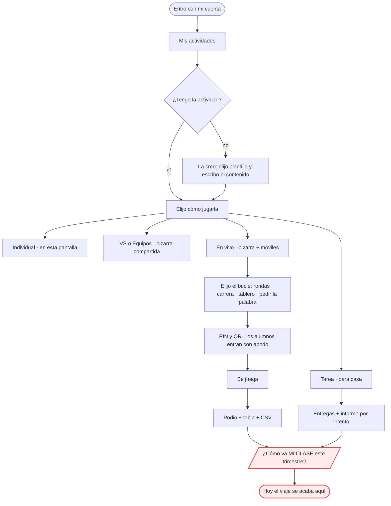

# EL NORTE — para quién es esto, y cómo se decide

> **Rango**: este documento manda sobre los demás. `docs/leyes.md` dice cómo se
> construye; **este dice qué construimos y para quién**. Si una ley y el norte
> chocan, gana el norte y la ley se replantea.
>
> **Estado**: BORRADOR v1 (v1.51.364). Lo marcado **[CONFIRMAR]** es propuesta
> mía a partir de lo que ya está construido y de lo que hemos ido decidiendo;
> hay que afinarlo con el usuario antes de tratarlo como decisión firme. Lo
> demás ya está decidido y está en el código.

---

## 1. La escena

Un profesor, en su aula, con una **pizarra interactiva** delante de la clase.
Tiene 45 minutos y ha abierto la app **tres minutos antes de empezar**. Los
alumnos, si participan desde su sitio, usan **su propio móvil**.

Todo lo que sigue se juzga contra esa escena.

## 2. La promesa (una frase)

> **Convertir cualquier contenido del profe en una actividad jugable en clase,
> en menos tiempo del que tarda en escribirla en la pizarra.**

Lo que hace única a la app frente a los referentes: **el mismo contenido se juega
de cinco maneras** (uno solo, duelo, equipos, toda la clase en vivo, o de tarea)
sin volver a escribirlo. Esa es la razón de ser del modelo de cuatro capas: si
una actividad supiera en qué modo corre, esa promesa sería imposible de mantener.

## 3. Las restricciones duras

No son preferencias: son el terreno. Una función que las incumpla está mal
planteada, aunque funcione en el portátil del que la programa.

| # | Restricción | Qué implica |
|---|---|---|
| **R1** | **La pantalla principal es una pizarra táctil de gama baja**, a 2-3 metros, mirada por 30 personas a la vez | Nada de texto pequeño ni de tamaños fijos; los objetivos táctiles son grandes; sin bucles de animación en reposo (`ww-lite`); contraste alto |
| **R2** | **El profe no configura nada.** Abre y juega | Cero pantallas de ajustes obligatorias; lo que se pueda derivar, se deriva; los ajustes finos son opcionales y viven en el editor |
| **R3** | **El alumno no tiene cuenta.** Entra con un PIN | La identidad del alumno es del aula, no del sistema; la seguridad va por reglas de servidor, no por login (§22) |
| **R4** | **La red del colegio es mala** y los móviles se bloquean | Todo estado importante vive en el servidor como INSTANTE, no como temporizador local; las escrituras se reintentan solas; recargar nunca pierde nada |
| **R5** | **El servidor es una Raspberry Pi compartida** | Los límites son reales y están declarados (§25); una función que multiplique las consultas por alumno hay que medirla ANTES |
| **R6** | **La clase no espera.** Un fallo con 28 críos delante no se depura | Fallar en silencio está prohibido: o funciona, o lo dice claro y sigue |

## 4. Lo que NO somos **[CONFIRMAR]**

Decirlo importa tanto como decir lo que sí: la mitad de las discusiones de diseño
se resuelven aquí.

- **No somos un LMS.** No gestionamos matrículas, ni currículo, ni boletines.
  Nos integramos con lo que el colegio ya use (Classroom) en vez de sustituirlo.
- **No somos evaluación formal.** Lo que se guarda sirve para que el profe VEA
  cómo va la clase, no para poner notas oficiales. Por eso el alumno no tiene
  expediente ni cuenta.
- **No somos una red social.** La biblioteca pública es para reutilizar
  actividades, no para seguir a nadie ni acumular seguidores.
- **No somos una app de estudio en casa.** El modo Tarea existe para extender la
  clase, no para sustituirla. Si algo solo tiene sentido con el alumno solo en
  su casa, probablemente no es nuestro.

## 5. Los referentes: qué tomamos y qué no **[CONFIRMAR]**

| | Wordwall | Kahoot | Nosotros |
|---|---|---|---|
| **Idea central** | un contenido, muchas plantillas | una sala en vivo con PIN | **las dos**: un contenido, muchas plantillas Y muchos modos |
| **Qué TOMAMOS** | el catálogo de mecánicas · cambiar de plantilla sin reescribir · la biblioteca reutilizable | el PIN + QR · el ritmo marcado por el profe · el podio como cierre emocional | — |
| **Qué NO tomamos** | la maraña de opciones por actividad (choca con R2) · el muro de pago por plantilla | que TODO sea la misma carrera de preguntas · el ranking en pantalla durante el juego (decisión C-2: durante el juego se muestra **avance**, no puestos) | — |
| **Dónde vamos por delante** | — | — | el mismo contenido en 5 modos · 4 bucles en vivo distintos (no solo rondas) · funciona en la pizarra sin que los alumnos tengan dispositivo |
| **Dónde vamos por detrás** | biblioteca enorme y taxonomía (D5) · imprimibles (D3) | analítica pulida · identidad del alumno a lo largo del curso (D1) | — |

## 6. El criterio de decisión

Ante cualquier función nueva, en este orden:

1. **¿Sirve en la escena del §1?** Un profe que no ha preparado nada, tres
   minutos antes, con la pizarra encendida. Si solo sirve preparándolo en casa,
   va al final de la lista.
2. **¿Rompe alguna restricción dura (§3)?** Si sí, no se parchea: se replantea.
3. **¿Cae en "lo que no somos" (§4)?** Si sí, se descarta o se integra con quien
   ya lo hace.
4. **¿En qué capa vive (§0 de las leyes)?** Si no encaja en ninguna, el diseño
   todavía no está listo.
5. **¿Qué test la vigila?** Si la respuesta es "ninguno", no está terminada.

## 7. El viaje del profesor — dónde estamos

Esto es lo que hoy puede hacer, de principio a fin. En **rojo** lo que falta.

**El hueco, dicho claro**: el viaje termina en el informe de UNA partida. El
profe ve cómo fue *esa* sesión, pero no cómo va *su clase*, porque el sistema no
sabe quién es "Juan": cada partida crea apodos nuevos y desechables (R3 + la
decisión de no dar cuenta al alumno). Ese es exactamente el contenido de **D1 ·
identidad del alumno** (`docs/decisiones-pendientes.md`), y por eso es la
siguiente pieza estructural: no añade una función, **cierra el viaje**.

Y una consecuencia que conviene ver: D1 es además el prerrequisito del PIN/NFC
para pizarras (U2-U4) y de los informes por alumno. Tres cosas paradas por la
misma pieza que falta.

## 8. Cómo se relaciona con el resto de la documentación

| Documento | Responde a |
|---|---|
| **este** | qué construimos, para quién, y cómo se decide |
| `docs/leyes.md` | cómo se construye (8 leyes, cada una con su test) |
| `docs/arquitectura-modulos.md` | cómo está montado HOY (generado del código) |
| `docs/modos-de-juego.md` | el contrato de los 5 modos y los 4 bucles |
| `docs/decisiones-pendientes.md` | qué está sin decidir, y la recomendación |
| `docs/estudio-bucles-live.md` | por qué el vivo es como es (estudio medido) |
